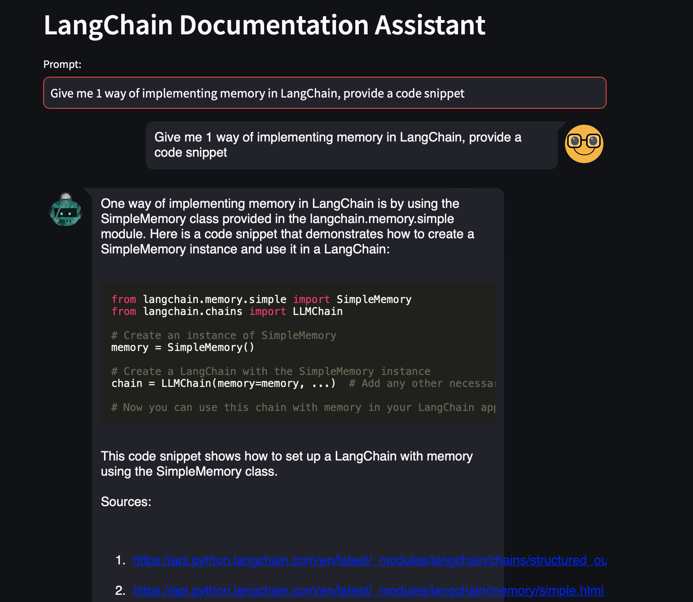

# LangChain Documentation Assistant

## Overview

The LangChain Documentation Assistant is designed to streamline the process of accessing and understanding LangChain documentation in ChatGPT-style. By integrating LangChain's RetrievalQA Chain with OpenAI's ChatGPT and a Pinecone vector store, this tool provides users with precise answers derived from the official LangChain documentation. Whether you're debugging code or seeking clarification on LangChain functionalities, the Documentation Assistant offers an efficient way to query information directly through an interface.


**Key Features:**
- **Direct Documentation Queries:** Allows users to ask questions directly and receive answers based on the LangChain official documentation.
- **Contextual Understanding:** Utilizes the RetrievalQA Chain to embed queries into vectors, enabling semantic search through documentation for relevant information.
- **Streamlined User Interface:** Employs Streamlit to provide a straightforward and interactive querying experience.

This project is particularly useful for developers working with LangChain, offering an immediate way to access updated documentation and reducing the dependency on external resources like StackOverflow or outdated ChatGPT data.

## Installation

To set up the LangChain Documentation Assistant, you'll need Python, pip, and optionally pipenv for managing virtual environments. Follow these steps:


1. **Environment Setup:**

    After cloning the repository, It's recommended to use pipenv for creating a virtual environment. If you haven't installed pipenv yet, you can do so with pip:

    ```bash
    pip install pipenv
    ```

    Then, initialize the virtual environment and install dependencies:

    ```bash
    pipenv install
    pipenv shell
    ```

2. **Install Dependencies:**

    Within the virtual environment, install the necessary packages:

    ```bash
    pipenv install langchain openai streamlit pinecone-client streamlit-chat python-dotenv
    ```

3. **API Keys Configuration:**

    You will need API keys for OpenAI and Pinecone services. After obtaining them, create a `.env` file in the project root directory with the following content:

    ```plaintext
    OPENAI_API_KEY=your_openai_api_key_here
    PINECONE_API_KEY=your_pinecone_api_key_here
    ```

## Running the Assistant

With the setup complete, you can start the LangChain Documentation Assistant using Streamlit:

```bash
streamlit run main.py
```
